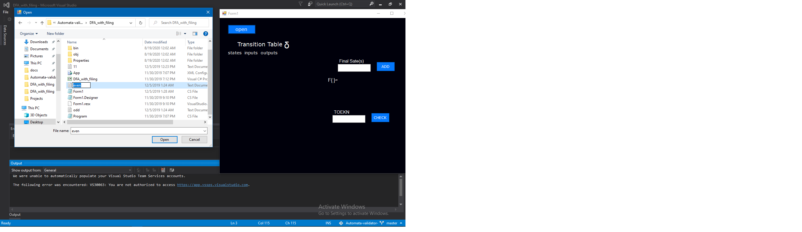
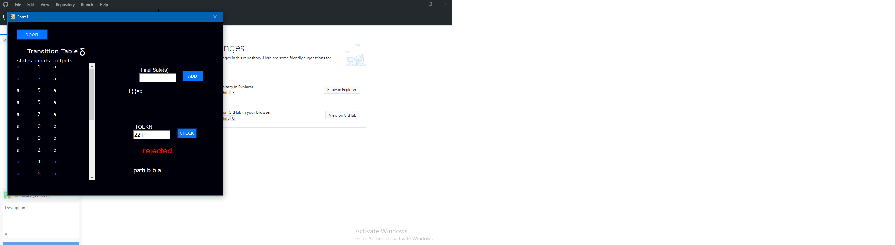
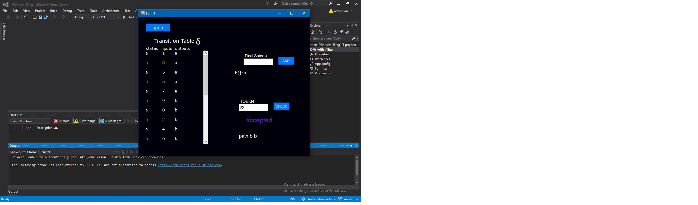

# Automata-validator-
The program takes a deterministic automata machine table as input either by console or read from a file,after the table has been fed and  
final states(s) is defined the program can validate strings against the table as accepted or un accepted

